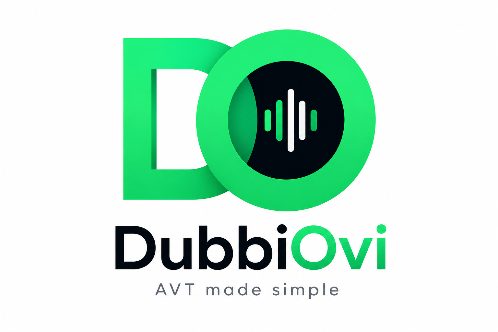

# DubbiOvi Public Website

This repository contains the complete public marketing and documentation website for **DubbiOvi**, an open-source AI-assisted audiovisual translation environment developed at the University of Oviedo by Alfonso C. Rodríguez Fernández-Peña.

The website is designed with a premium, responsive dark-mode aesthetic featuring blue/violet accents, interactive workflow steps, academic citations, downloads, and a comparison matrix against traditional cloud platforms.

## 🚀 Tech Stack

- **HTML5**: Structured semantic markup.
- **Tailwind CSS**: Utility-first CSS styling (loaded via play CDN for zero compilation steps).
- **Vanilla JavaScript**: Interactive client-side components (header scroll effect, mobile menu drawers, citation tabs, citation clipboard copying, and animation hooks).
- **Custom CSS (`styles.css`)**: Glassmorphism cards, mesh radial gradients, custom scrollbar styling, stepper active highlights, and scroll-reveal triggers.

---

## 💻 Local Development

To run the website locally and preview changes in real time, you can launch a lightweight web server from the repository root:

```bash
# Using Python 3
python3 -m http.server 8000

# Using Node.js (npx)
npx serve
```

Once running, navigate to `http://localhost:8000` in your web browser.

---

## 📦 GitHub Pages Deployment

The repository is configured to be fully compatible with **GitHub Pages** for free, high-performance static hosting.

### Option 1: GitHub Actions Deployment (Recommended)
We have included a pre-configured GitHub Actions workflow in `.github/workflows/deploy.yml`. To enable automated deployment on every commit:
1. Push this project to a GitHub repository on the `main` branch.
2. In your repository settings on GitHub, navigate to **Settings** &rarr; **Pages**.
3. Under **Build and deployment** &rarr; **Source**, select **GitHub Actions**.
4. Every push to the `main` branch will automatically build and publish the site.

### Option 2: Manual Deployment from Branch
Alternatively, to deploy directly from a branch:
1. Push the code to your repository.
2. Under **Settings** &rarr; **Pages**, set **Build and deployment** &rarr; **Source** to **Deploy from a branch**.
3. Select the branch (e.g., `main`) and root folder (`/`), then click **Save**.

---

## 🎨 Asset Maintenance & Customization

- **Logo Proposal**: The generated project logo proposal is located in `assets/logo-proposal.png` and displayed in the *About* section.
- **Typographic Header Logo**: If you choose to replace the typographic `DO DubbiOvi` logo in the header with an image, replace the `DO` `div` tag in `index.html` with an `` tag pointing to your logo file:
  ```html
  
  ```
- **App Screenshots**: Once real screenshot captures from the DubbiOvi application workspace are ready, place them in the `assets/` folder (e.g., `assets/sc-transcribe.png`, `assets/sc-translate.png`, `assets/sc-sync.png`) and replace the mock structure divs inside the screenshot gallery section (`index.html`) with direct image elements.
